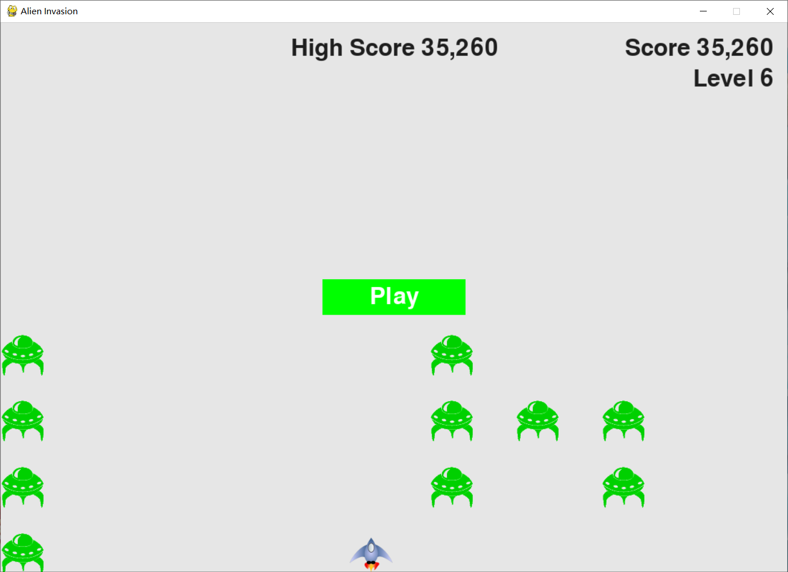
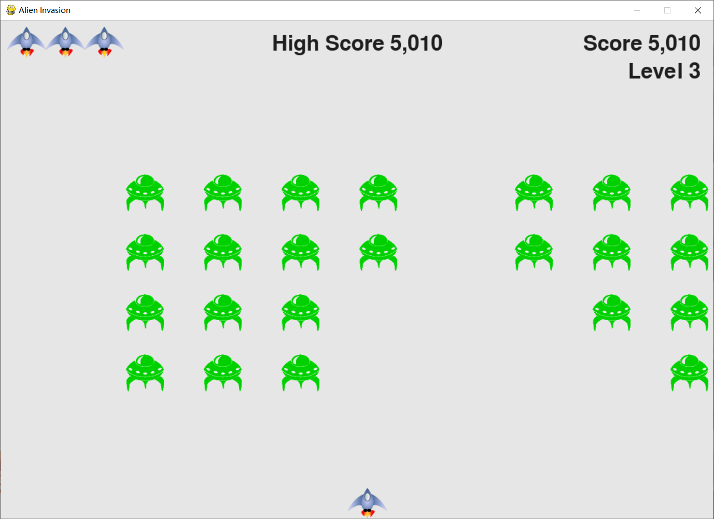

# 外星人入侵

## 要求

需要安装 pygame 模块,可通过在命令行输入`pip install pygame`
或`pip3 install pygame`命令进行安装.

## 玩法

游戏会在鼠标单击`play`按钮或按键盘上的`P`键开始.
此时会有一大波外星人像你移动.而你的任务就是射杀他们.

你将通过左右方向键来控制飞船移动,按`space`键射击.初始时你有三只飞船,
而每当外星人碰到你或触及到屏幕底端,你将损失一架飞船.当三个飞行船消耗殆尽游戏将结束.

每当你射杀完一波外星人以后,下一波外星人移动速度将会变得更快,相应的你的飞船也会升级.
以提高游戏的可玩性.

|快捷键|作用|
|:---:|:---:|
|Esc|退出|
|P|开始|
|space|开火
|方向键|移动
